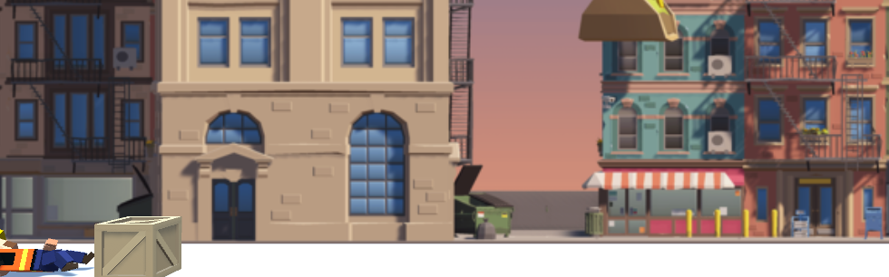
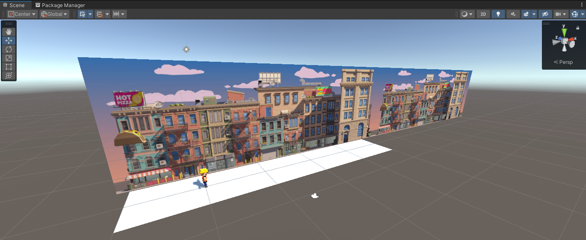

# 🏃‍♂️💥 Unity Endless Runner – Jump & Crash Challenge

This project is a fast-paced **endless runner** game created in Unity. The player can press the **Spacebar** to jump and must avoid incoming obstacles. Obstacles and the background scroll from right to left, while player animations and collision effects bring the game to life.

---

## 📸 Screenshots

### 🎮 Game View:

### 🛠️ Scene View:

---

## 🎯 Challenge Summary

### 🎮 Gameplay:
- 🕹️ Press **Spacebar** to jump (double jump is disabled)
- 🧱 Obstacles are spawned at intervals
- 🌄 The background scrolls seamlessly
- 💥 On collision, the game stops: both background and obstacles freeze, and an explosion effect is played

---

## 🔧 Technical Features

### 🚶‍♂️ Player Movement
- Controlled via `GetComponent<Rigidbody>()`
- Single jump implemented with `AddForce(..., ForceMode.Impulse)`
- Rotation is locked using `Rigidbody.constraints`
- Uses `Physics.gravity`, booleans, `*=` and `&&` operators for jump logic
- Collision is handled using `OnCollisionEnter()`
- Double jumping is prevented using a boolean flag

### 🌄 Background & Obstacles
- Background repeats seamlessly (`Repeat background`)
- `GetComponent<Collider>().bounds.size.x` is used to detect background width
- Obstacles are spawned at intervals using `InvokeRepeating()`
- On collision, both background and obstacles are paused
- Off-screen obstacles are automatically destroyed using `Destroy()`

### 🕴️ Animation System
- Running animation is triggered when movement starts
- Jump animation plays during jumps
- Crash animation plays upon collision
- Controlled via the `Animator` component using:
  - `SetTrigger()`, `SetBool()`, `SetInt()`
  - Animation transitions, layers, and parameters

### 🔊 Audio & Effects
- 🎵 Background music loops throughout gameplay
- ✨ A **particle system** under the player's feet simulates running effects
- 💥 On collision:
  - An explosion particle effect is played
  - A crash sound effect is triggered
- Audio is handled using `AudioSource` and `AudioClip` for playback control

---

## 🧠 Concepts Learned

| Concept                    | Application                                                |
|----------------------------|-------------------------------------------------------------|
| `GetComponent<>()`         | Access Rigidbody, Collider, Animator components             |
| `ForceMode.Impulse`        | Apply instant force (jumping)                              |
| `Physics.gravity`          | Control and tweak gravity values                            |
| `Rigidbody.constraints`    | Prevent unwanted player rotation                            |
| `OnCollisionEnter()`       | Detect collisions                                           |
| `SetTrigger()` / `SetBool()` | Control animation transitions via script                |
| `AudioSource.Play()`       | Trigger audio clips                                         |
| `CompareTag()`             | Check object tags for interaction                          |
| `InvokeRepeating()`        | Schedule recurring spawn actions                           |

---

## 🗂️ Project Folder Structure
